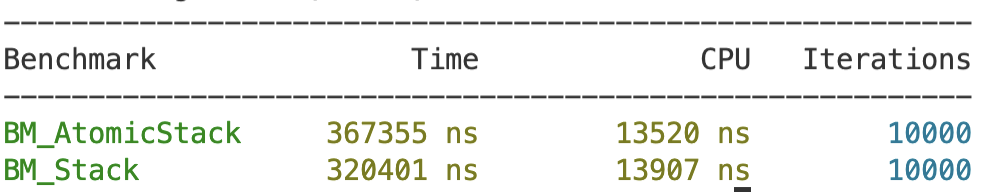
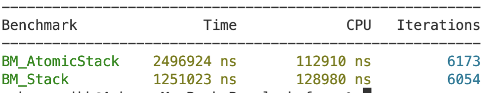
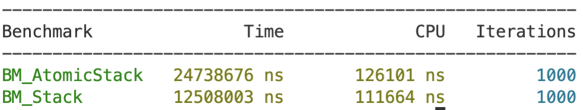
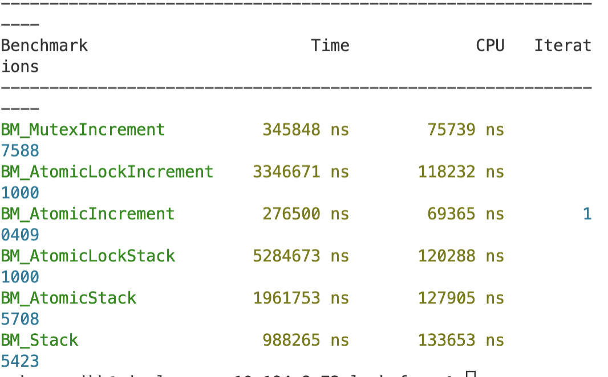

# Benchmarking Stack Performance in C++

I was curious what the performance difference was between using atomics and mutexes as a locking mechanism in C++, so that data reads/writes can occur in multithreaded situations without data races.

I implemented three stacks, one with the std::mutex, one with atomics, and one with an atomic mutex, and benchmarked with Google Benchmark to see how long it would take to add ints to the stack in different settings. So far, mutex performs the best. My current theory is that there are some optimizations happening with std::mutex that delivers the lowest overhead with between context-switching and busy-waiting.

### 1 Thread, 10000 Objects Each

### 10 Threads, 1000 Objects Each

### 100 Threads, 1000 Objects Each

## With an increment counter test with 10 Threads, 1000 Objects Each

## Installation

1. Install [Google Benchmark](https://github.com/google/benchmark) to the root directory
2. Run `make`